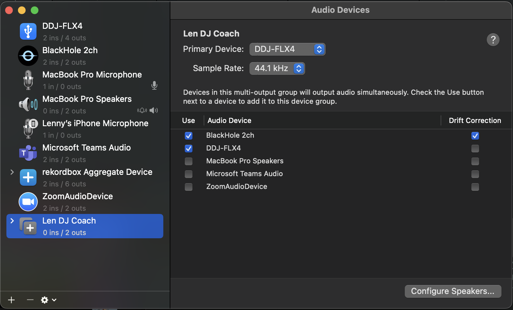
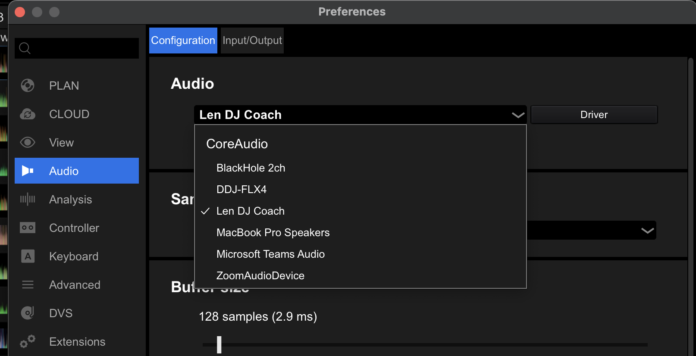

# Day 1

March 26th, 2026

## Quick Thoughts

This is my first day working on this, and I was DJ-ing a little bit just to let off steam from work.

I then had the idea of how it could be cool to get feedback on what I'm doing.

This was motivated by the fact that I would already record myself, listen back on it, and then write notes on what I wish I did better.

I'm a big fan of apps like Strava, and Hevy for tracking progress, and in a way, this would be something similar.

And plus, I was already replicating this flow locally with a combination of Rekordbox, and YouTube.

If I could tighten the feedback loop, that would be sick.

So, let's see what happens!

Maybe I can split some real time stuff and some post-analysis stuff, almost like kareoke can see if you're in key and then give you an overall score after.

## Goals

I think I want to try to code this mostly myself. I will definitely be using AI, but the focus won't be on agentic flows but rather making sure I do things with clean interfaces and things like that. Well, at least I can be optimistic. lol. Plus, working with streaming audio files will be interesting... right?

Also took some time to setup uv, mise, and stuff as inspired from work so hopefully it doesn't get toooo messy.

## End of Day Progress

Was able to get something together that picks up on button presses... but right now no sound is actually getting picked up. So I need to figure that out.


# AI Slop Appendix

## Conversation with Claude

```
## Summary: DJ Session Analysis & Feedback Platform

### The Intent

Build a **post-session DJ analytics tool** (think "Strava for DJ sets") that records complete DJ performances, analyzes them automatically, and provides actionable feedback on mixing quality, transitions, and song choices.

The goal: help DJs **review their own sets, identify patterns, and improve over time** through data-driven feedback.

---

### Why This Matters

1. **DJs have no feedback mechanism** — After playing a set, you can't easily review what worked/didn't
2. **Metrics are invisible** — You don't track BPM consistency, key harmony, energy flow, button presses over time
3. **Pattern recognition is hard** — What transitions work? What filter techniques land? You have to rely on feel
4. **Improvement is slow** — Without data, it's just repetition, not deliberate practice

---

### What We've Considered

#### **1. Initial Idea: AI DJ Commentator**
- **Concept**: Feed a full DJ set to an LLM, get critical commentary
- **Problem**: Massive audio files are expensive ($) and slow
- **Evolution**: Realized we don't need to identify songs—just analyze the audio itself

#### **2. Approach: Local Audio Analysis Only**
- **Concept**: Use librosa + Python for BPM, key, energy extraction (no LLM)
- **Benefits**: Zero latency, zero cost, local computation
- **Trade-off**: Less "natural" commentary, but more precise metrics

#### **3. Real-Time DJ Feedback**
- **Concept**: Connect directly to FFLx4, analyze transitions as they happen
- **Problem**: Need to solve audio routing (capturing Rekordbox output to Python)
- **Consideration**: Can use hotkey trigger or auto-transition detection
- **Realized**: Real-time might be overkill—post-session analysis is more useful

#### **4. Full Session Recording & Visualization (Current Direction)**
- **What to capture**:
  - **Audio stream** (the mix itself)
  - **MIDI events** (every button press, fader movement, knob turn on FFLx4)
  - **Timestamps** (when each action happened)

- **Analysis pipeline**:
  - Segment detection (find where tracks transition)
  - Feature extraction per segment (BPM, key, energy, brightness, bass presence)
  - Transition scoring (how smooth was each mix?)
  - Event alignment (what buttons did you press during each segment?)

- **Visualization** (like Strava):
  - Timeline view of entire session
  - Each segment shows: BPM, key, energy, transition score
  - MIDI events displayed inline (which fader/button was used when)
  - Playback scrubber to replay specific moments
  - Over time, see patterns and improvements

#### **5. What We Ruled Out**
- ❌ **Song identification**: Too expensive (Shazam APIs, Spotify lookups), not necessary
- ❌ **Real-time LLM commentary**: API costs + latency too high for live feedback
- ❌ **Grading system**: Too rigid; commentaries/metrics are more useful
- ❌ **Requiring user setlist input**: Auto-segmentation is good enough

---

### The Tech Stack (Current Plan)

**Recording**:
- PyAudio (capture from FFLx4 USB input)
- mido (capture MIDI from FFLx4)
- Simultaneous recording with timestamps

**Analysis**:
- librosa (BPM, key via chroma, energy, spectral features)
- numpy (feature math)
- JSON for metadata storage

**Visualization**:
- React dashboard (Strava-style timeline)
- Shows each segment with metrics + button presses
- Playback with scrubber

**Workflow**:
```

Record session → Save audio + MIDI events → Analyze → Visualize → Review & iterate

```

---

### Why This Approach Works

✅ **Low cost**: No APIs, all local computation
✅ **Fast**: Analysis runs in minutes, not hours
✅ **Practical**: You actually see what you did (button presses) + how it sounded (metrics)
✅ **Iterative**: Build record → analyze → visualize, then add intelligence later
✅ **Novel**: Nothing exactly like this exists (closest is research projects)
✅ **Scalable**: One session at a time, compare across many sessions over time

---

### What We Haven't Built Yet

1. **The recorder** — Python script to capture audio + MIDI simultaneously
2. **The analyzer** — Segmentation + feature extraction pipeline
3. **The dashboard** — React UI to visualize sessions
4. **The iteration loop** — Multi-session comparison, pattern detection

---

### Next Steps (If You Want to Build)

**Phase 1 (MVP)**:
- Record a single session (audio + MIDI)
- Basic analysis (segment + extract BPM/key/energy)
- Simple CLI or web view of results

**Phase 2**:
- Smooth visualization (React dashboard)
- Transition scoring
- Event alignment (show what buttons you pressed when)

**Phase 3**:
- Multi-session comparison
- Pattern detection ("You always use this filter transition")
- Improvement tracking over time

---

Does this capture what we're going for? Want to start building Phase 1?
```

## Compacted Claude Conversation

```
# DJ Set Analyzer - Project Summary

## Goal
Build a Strava-like app that records DJ sets (audio + MIDI) and provides real-time/post-session feedback on mixing quality, transitions, and song choices.

## Current Status: Phase 1 - Basic Recording Working
- ✅ Recording audio from DDJ-FLX4
- ✅ Recording MIDI events (button presses, fader movements)
- ✅ Auto-detecting FFLx4 devices
- ✅ Pretty-printing MIDI events with control names
- ⚠️ Audio file created but silent (routing issue to solve)

## Tech Stack
- **Audio**: sounddevice + soundfile
- **MIDI**: mido + python-rtmidi
- **Analysis**: librosa, numpy (for future)
- **Dev**: uv, ruff, mise
- **Python**: 3.11+

## Project Structure


dj-analyzer/
├── pyproject.toml
├── uv.lock
├── .mise.toml
├── dj_analyzer/
│ ├── **init**.py
│ └── capture.py


## Key Files & Commands

uv sync                    # Install deps
uv run dj-capture         # Record session
uv run ruff format        # Format code
mise run setup-dev        # Dev setup


## Latest Code: `dj_analyzer/capture.py`

- `SimpleCapture` class: handles audio + MIDI capture
- `_find_audio_device()` & `_find_midi_device()`: auto-detect FFLx4
- `format_midi_event()`: pretty print with emoji + control names
- Saves to `capture_YYYYMMDD_HHMMSS.wav` + `.json`

## MIDI Mapping (DDJ-FLX4)

Official Pioneer spec fetched. Key controls:

- **CC 19**: Crossfader
- **CC 10/11**: Trim Left/Right
- **CC 17/18/27**: EQ High/Mid/Low Left
- **CC 40/41/42**: EQ High/Mid/Low Right
- **CC 43/44**: Filter Left/Right
- **CC 51**: Master Level
- **Notes**: Performance pads (27-34 = hot cues, etc)
- **Channel**: 0=Deck1, 1=Deck2, 6=Master

## Current Issue

**Silent audio file** - FFLx4 audio routing to computer not working. Likely needs:

- Virtual audio loopback (BlackHole on Mac)
- Or check if FFLx4 USB output is properly routed to input

## Next Steps

1. Solve audio routing (BlackHole or native routing)
2. Test audio capture working
3. Build analyzer: segment detection + feature extraction (librosa)
4. Build React dashboard for visualization
5. Add multi-session comparison

## Notes

- MIDI events working perfectly (1600+ captured in 35s)
- Code is clean, formatted with ruff
- All deps pinned in uv.lock
- Pretty printing handles left/right deck, shows percentages

```

## Audio MIDI Setup Steps





````
To get your "DJ Coach" app recording properly, you need to create a **Multi-Output Device** so the audio goes to both your speakers and your Python script.

Here are the precise steps for your macOS setup:

### 1. Create the Multi-Output Device
1.  **Open Audio MIDI Setup**: Press `Cmd + Space`, type "Audio MIDI Setup," and hit Enter.
2.  **Add a New Device**: Click the **`+`** icon in the bottom-left corner and select **Create Multi-Output Device**.
3.  **Select Your Hardware**: In the panel on the right, check the boxes for:
    * **BlackHole 2ch** (The virtual "recording" bridge).
    * **DDJ-FLX4** (Your physical controller/speakers).
4.  **Master Device**: Set the **Master Device** dropdown at the top to **DDJ-FLX4**.
5.  **Drift Correction**: Check the "Drift Correction" box for **BlackHole 2ch** only. Leave it unchecked for the FLX4. This prevents the audio from drifting out of sync during long sets.


---

### 2. Configure Rekordbox
Now you need to tell your DJ software to send the master mix into that new "bridge."
1.  Open **Rekordbox Preferences** (`Cmd + ,`).
2.  Go to the **Audio** tab.
3.  Set **Audio** to your newly created **Multi-Output Device**.
4.  **Crucial Check**: Make sure the **"PC MASTER OUT"** icon (the tiny laptop icon at the top right of the main Rekordbox screen) is **ON**.
5.  Scroll down to **Output Channels**:
    * **Master Output**: Should show `Multi-Output Device : CH 1/2`.
    * **Headphones Output**: Should still be set to `DDJ-FLX4 : PHONES`.

---

### 3. Verify Your Python Script's "Ears"
Since the audio is now flowing through BlackHole, your script needs to listen to that specific virtual input.

1.  Find the index for BlackHole by running:
    ```bash
    uv run python -c "import sounddevice as sd; print(sd.query_devices())"
    ```
2.  Look for the index number for **"BlackHole 2ch"** under the **Input** section.
3.  Update your `capture.py`:
    ```python
    # In your SimpleCapture class
    self.audio_device = <THE_BLACKHOLE_INDEX>
    ```

### Why this works
By using a **Multi-Output Device**, macOS "clones" the signal. One copy goes to the FLX4 (so you can hear it on your speakers), and the other copy goes into the BlackHole "pipe." Your Python script sits at the other end of that pipe and records the clean digital stream.

[Audio Routing with Blackhole](https://www.youtube.com/watch?v=zhBjXyNxrFE)
This video provides a visual walkthrough of setting up multiple audio outputs on a Mac, which is exactly the logic needed to mirror your DJ audio for your app.
````

## Gemini Dependency Fix

```
It’s a huge win to get that data streaming! Here is a post-mortem of the "boss battles" we fought to get your DJ Coach prototype alive.
1. The Environment Battle (Python 3.13)

* The Issue: You were using Python 3.13, which is so new that many "heavy-lifter" libraries like llvmlite (used for fast math) aren't ready for it yet. The build failed because the installer tried to use "deprecated" (old) code that Python 3.13 finally deleted.
* The Fix: We downgraded to Python 3.12.
* Why: Python 3.12 is the current "sweet spot." It has pre-compiled Wheels (ready-to-use binaries) for your Mac, so your computer didn't have to try (and fail) to build the software from scratch.

2. The Dependency Battle (uv & Indexes)

* The Issue: uv noticed you had two places to find software (PyPI and Anaconda). For security, uv stops looking if it finds any version of a package on the first list. It found an old, broken version of llvmlite on Anaconda and refused to check the "good" list on PyPI.
* The Fix: We used --index-strategy unsafe-best-match and pinned versions to ~=0.44.0.
* Why: This forced uv to look at both lists and pick the version that actually worked for your Mac's M-series chip.

3. The Audio "Ghost" Battle (BlackHole)

* The Issue: You had the "virtual cable" (BlackHole) installed, but Rekordbox was only talking to your controller hardware. The "cable" was plugged into your script, but the other end was just sitting on the floor.
* The Fix: You clicked the "PC Master Out" button (the blue computer icon) in Rekordbox and set your Mac's System Output to BlackHole.
* Why:
* PC Master Out tells Rekordbox: "Send sound to the laptop's speakers too, not just the DJ decks."
   * System Output = BlackHole tells the Mac: "Take that sound and pipe it into the virtual cable."
   * The Result: Your script, which was "listening" to the other end of that cable, finally heard the music.

------------------------------
📝 Summary of Steps Taken

   1. Fixed pyproject.toml syntax: Put brackets [ ] around the extra index URL.
   2. Downshifted Python: Moved from 3.13 → 3.12 for library stability.
   3. Aligned Versions: Locked numba and llvmlite to versions that have Apple Silicon "Wheels" (0.60.0 and 0.43.0).
   4. Enabled the Bridge: Activated "PC Master Out" in Rekordbox to bridge the gap between DJ hardware and Mac software.
   5. Routed the Signal: Set Mac System Sound to BlackHole.

Now that you have a .wav and a .json from a successful run, would you like a script to "Replay" the set visually so you can see your fader moves synced to the audio?
Shopping Query Follow-up(s)

* Do you want help setting up a Multi-Output Device so you can hear the music through your Speakers while it's recording?
* Would you like a snippet to clean up the MIDI JSON so it's easier to read for analysis?

```
