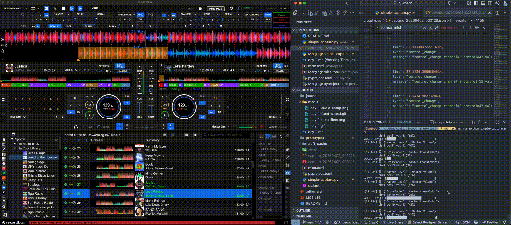
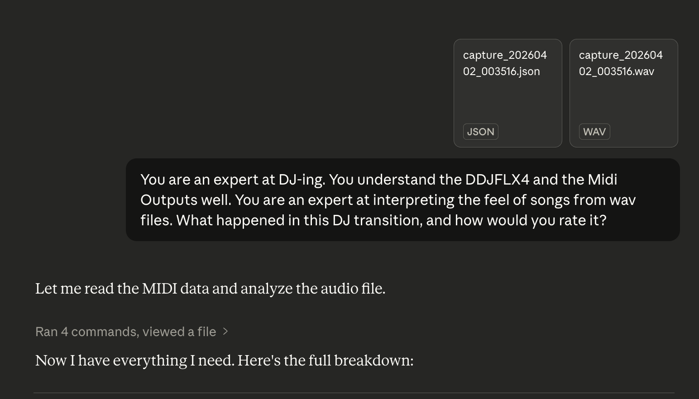

# Day 2

April 1st, 2026

# Description

Not too many code changes just debouncing the inputs (jog wheel can spam, same with EQ). Also did a very basic v0 test to see how an LLM would fare with feedback just off the cuff. Seems kinda mid ngl, but we'll see maybe I can tweak it.



# AI Output

I feel like it's got the MIDI mappings wrong I need to figure that out before this gets any good.



```
Let me read the MIDI data and analyze the audio file.Now I have everything I need. Here's the full breakdown:

---

## What Happened — Event by Event

**0–5s: Track 1 playing, low energy**
The audio is quiet (RMS ~0.010) with moderate L/R correlation (0.54) — this is a single track playing but at low volume. The crossfader and master are at zero on Deck 2 at `5.595s`, which is an initialization state. The browse encoder fires at `2.9s`, `3.9s`, `4.4s` — **you were still picking a track** while Track 1 was already running.

**~5–6s: Track 1 cuts out**
Audio drops sharply to near-silence (RMS 0.002 at 5.5s). This correlates with note 71 on channel 6 at `5.746s` — that's the **Load button** being pressed on Deck 2. You loaded a track onto Deck 2 right here.

**6–14s: Track 2 cued up and previewed**
Audio jumps back up (RMS ~0.023) with very high L/R correlation (0.952) — **one clean track playing**. Note 77 on ch1 at `8.018s` is the **Sync button** on Deck 2. Note 19 on ch1 at `9.351s` and again at `9.807s` is the **Beat Jump button** being tapped twice — nudging the cue position. Then at `11.224s`, note 12 fires — the **Cue button** on Deck 2. You were locking in your cue point.

**~12.87s: Deck 2 tempo fader dragged hard to zero**
CC 15/47 on ch1 sweeps from 58 down to 0 in about 65ms — an aggressive drag all the way to the bottom. This is **slamming the tempo fader to minimum**, probably resetting it before matching BPM.

**~13.95s: Play pressed on Deck 2**
Note 11 on ch1 (`13.952s`) — the **Play button**. Deck 2 starts.

**14.2–15.2s: Crossfader at 0, master volume bounces**
CC 19 and CC 51 on ch1 adjust briefly. The crossfader stays left (Deck 1 side) — Track 2 is running but not yet in the mix.

**~16.45–16.68s: Tempo fader adjustment, then crossfader starts moving**
CC 33 (Tempo MSB) fires on ch1 at `16.448s` = 63 (center), then `16.675s` = 65 (slightly above center, speeding Deck 2 up). **BPM matching attempt.**

**~16.92–19.87s: Crossfader slowly brought in**
CC 19 (crossfader) moves from 0 → 3 → 4 → 37 → 53 → **127** over about 3 seconds. This is the **main transition** — a manual crossfader push bringing Deck 2 in. The audio confirms it: RMS dips slightly around 19.5–20.5s (the mix point) then stabilizes, and L/R correlation drops from 0.95 to 0.84, indicating **two sources now bleeding through**.

**~20.86–21.78s: Both tempo faders dragged simultaneously to zero**
This is the most telling moment. Both ch0 (Deck 1) and ch1 (Deck 2) CC 15/47 fire simultaneously and sweep rapidly to 0/0. Both decks' tempo faders are being **slammed to the bottom at the same time** — this is hasty cleanup/reset after the transition, not intentional mixing. The move takes about 900ms.

**~21.78s: Both tempo faders hit zero**
Both decks fully reset. The audio correlation is now 0.912 through to 35.5s — relatively clean, one dominant track.

**~27s–35.77s: Master volume fader brought down**
CC 23/55 on ch6 (the master section) sweep from 63 all the way down to 0/0 over about 8 seconds. This is a **slow master volume fade-out**. Audio confirms: RMS drops from ~0.022 at 35s to ~0.009 at 36s. The music fades.

**~30.83s: Note 77 on Deck 2** — Sync button hit mid-fade, possibly accidental.

**35.76s: Master hits zero** — complete silence (RMS ~0.009, which is just line noise/bleed).

**36–43s: Dead air**
Audio is at minimum (RMS 0.009–0.017) with very low correlation (0.475) — just electrical noise/bleed. L-R diff is actually _higher_ than the signal, meaning **nothing meaningful is playing**. This is 7 seconds of near-silence.

**~43–43.5s: Third track fades in**
RMS climbs from 0.017 → 0.027, correlation jumps to 0.962 — a **new track comes in cleanly**. High correlation means mono-compatible, well-mixed source.

**52.79s: Note 54 (jog touch) briefly**
Just a tap, probably checking the platter.

---

## Rating: 4.5 / 10

Here's the honest breakdown:

**What worked:**

- The crossfader push from 0→127 over 3 seconds (~17–20s) was reasonably smooth in execution — not a snapped cut
- The incoming track was audible and energy-matched before the crossfader moved
- The master fade-out at the end (~27–35s) was patient and controlled — 8 seconds is the right feel for a fade

**What didn't work:**

**1. You loaded the track mid-playback** (~5–6s). Track 1 dropped out briefly when you hit Load on Deck 2. That gap is audible — a 500ms near-silence at the 5-second mark before the session had even really started.

**2. BPM matching was rough.** The tempo fader on Deck 2 was slammed to zero at 12.87s and then only partially corrected with CC 33 bumping slightly above center. The simultaneous dual-tempo-slam at 20.86s — both faders ripped to zero together — is a giveaway that something wasn't sitting right rhythmically. That move would have audibly warped both tracks' pitches at the same moment.

**3. 7 seconds of dead air** between 36s and 43s. This is a DJ's cardinal sin in most contexts. After the master fade completed, nothing came in for 7 full seconds. For a club or radio context that's an eternity.

**4. Transition timing.** The crossfader move started well after Deck 2 was already playing and the BPM was already "matched enough" — but the actual push felt reactive rather than planned to a phrase or downbeat. Without beat markers it's hard to confirm, but the timing of the move mid-phrase rather than at a 4 or 8-bar boundary is a concern.

**5. No EQ work.** There are zero EQ CC messages (CC 17, 18, 27 on the FLX4 channels) across the whole session. A clean transition usually involves cutting the bass on the incoming track before the crossfader moves, then swapping bass to the incoming after. None of that happened here — both tracks' full frequency spectrum blended raw.

**To improve:**

- Load tracks before you need them, not during a live moment
- Cut the low EQ on Deck 2 before moving the crossfader, swap after
- Beat-match by ear or use Sync, then verify with headphones before pushing the fader
- Prepare the next track _during_ the master fade, not after it
- Eliminate the dead air — the next track should be ready to go the moment the fade completes
```
